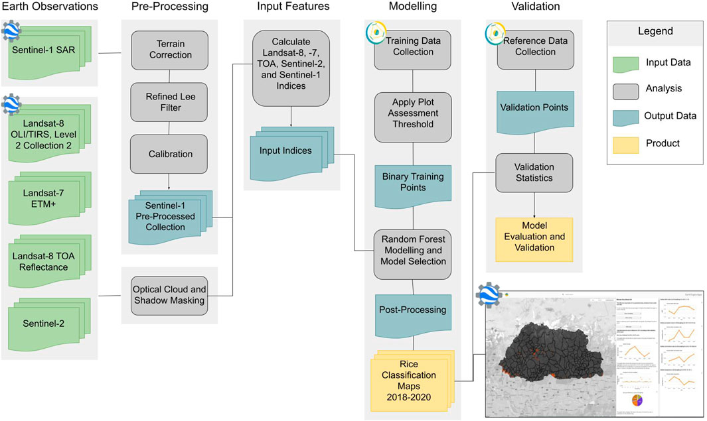

# ag-classification-estimation

Agricultural Classification and Estimation Service

  The GEE based UI is available [here](https://servirglobalnet.users.earthengine.app/view/aces-bhutan) | Publication [Employing the Agricultural Classification and Estimation Service (ACES) for mapping smallholder rice farms in Bhutan](https://www.frontiersin.org/articles/10.3389/fenvs.2023.1137835/full) | 
[Example of Collect Earth Online Standardized Training Data Survey](https://app.collect.earth/collection?projectId=33436)

